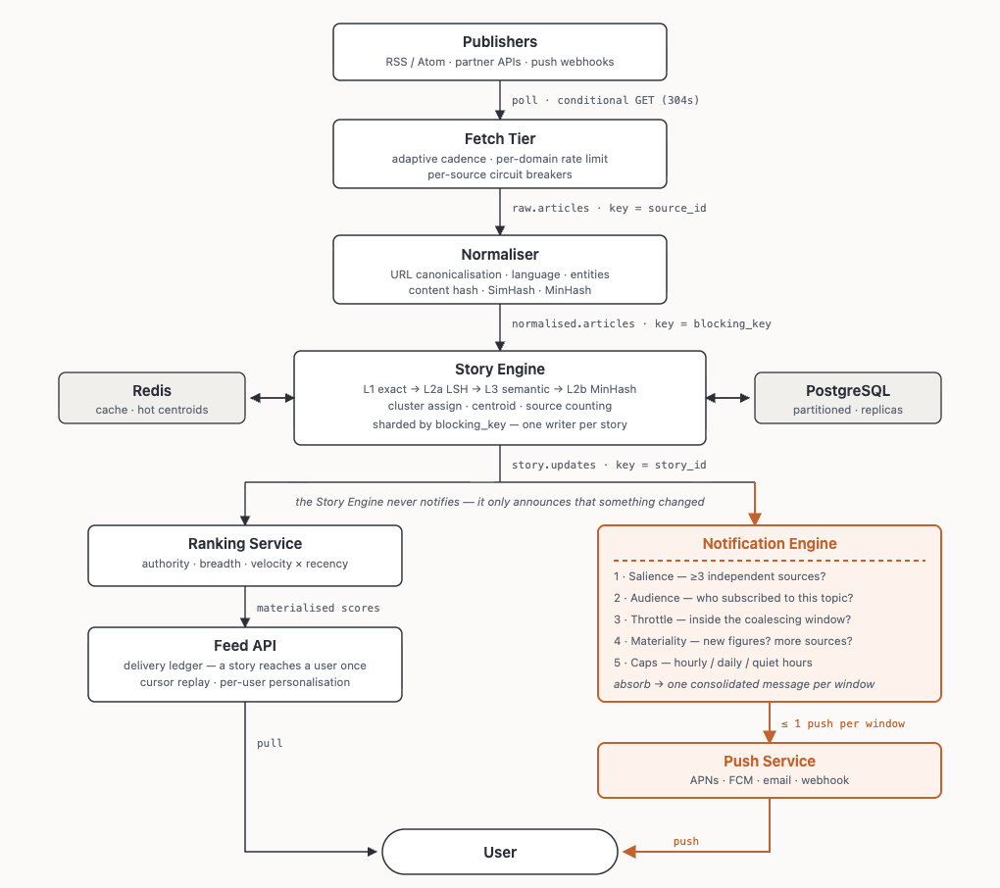

# Scalable News Aggregator — System Overview & Architecture



## 📌 Executive Summary

Modern news platforms suffer from extreme duplication. When a major real-world event occurs, hundreds of media outlets publish syndicated wire copies (e.g., Reuters, AP) or slightly rewritten headlines. Users are bombarded with the same story 10 times, clickbait ranks highly, and credible multi-source reporting is buried.

The **Scalable News Aggregator** solves this by shifting the core product unit from an individual **Article** to a **Story** (a real-world event cluster). It continuously ingests news from thousands of sources, collapses duplicates across 5 precision stages, clusters independent reporting of the same event into unified stories, ranks stories by credibility and recency, and serves a de-duplicated feed.

---

## 🏗️ System Architecture & Workflow

```
[RSS / Atom Feeds] ──▶ 1. Ingestion Engine (Conditional GET, Circuit Breaker)
                               │
                               ▼
                        2. Text Normalization (Clean HTML, Canonical URLs, Entities)
                               │
                               ▼
                        3. Deduplication Cascade (Exact Hash, SimHash + LSH, MinHash)
                               │
                               ▼
                        4. Semantic Story Clustering (Streaming TF-IDF + Entity Overlap)
                               │
                               ▼
                        5. Credibility Ranking & Feed Serving (Authority * Recency * Syndication)
```

---

## ⚡ Core Features & Technical Highlights

### 1. High-Performance Multi-Source Ingestion (`code/newsagg/ingestion/`)
- **Conditional GET (`HTTP 304`):** Uses `ETag` and `Last-Modified` headers to fetch only updated feeds, reducing network bandwidth by **>95%**.
- **Adaptive Cadence & Resilience:** Dynamic polling intervals based on feed activity. Domain-level token buckets and per-source circuit breakers prevent server overload.

### 2. Pure Text Normalization (`code/newsagg/text/normalise.py`)
- **Canonical URLs:** Strips 40+ tracking parameters (`utm_*`, `fbclid`, `gclid`), normalizes protocols, lowercase domains, and removes trailing slashes.
- **Unicode NFKD Cleaning:** Normalizes text accents, smart quotes, and dashes.
- **Named Entity Extraction:** Extracts proper nouns (People, Places, Organizations) for cross-outlet matching.

### 3. 5-Stage Deduplication Cascade (`code/newsagg/clustering/engine.py`)
- **Stage 1a (Exact URL):** SHA-256 hash of canonical URL $\rightarrow$ instant reject or revision update.
- **Stage 1b (Exact Body):** SHA-256 payload hash match $\rightarrow$ instant duplicate flag.
- **Stage 2a (Near-Duplicates / Wire Copies):** 64-bit **SimHash + LSH 8-Band Indexing**. Sub-linear $O(1)$ lookup for wire stories with rewritten headlines (Hamming distance $\le 7$).
- **Stage 3 (Story Clustering):** Sharded **Streaming TF-IDF** (terms hashed into $2^{18}$ space) + **Entity Overlap Jaccard**.
- **Stage 2b (In-Cluster MinHash Check):** 64-permutation MinHash over body 3-shingles against story members ($>0.45$ Jaccard threshold).

### 4. Credibility-Based Ranking (`code/newsagg/ranking/`)
Stories are ranked using a multi-factor formula:
$$\text{Score} = \text{Source Authority} \times \text{Syndication Multiplier} \times \text{Recency Decay}$$

- **Independent Coverage vs Syndicated Copy:** Independent sources contribute logarithmically to Authority ($\sum \log(1 + w_s)$), whereas 10 syndicated wire copies receive heavy sub-linear discounting.
- **Exponential Recency Decay:** Ensures fresh breaking news rises while old coverage gracefully drops.

---

## 📁 Repository Layout

When viewing the repository root, the project is structured as follows:

```
news_aggregator/
├── DESCRIPTION.md            # ← Detailed System Description & Architecture Document
├── README.md                 # ← Repository Landing Page
├── design.png                # ← High-Resolution System Architecture Diagram
│
└── code/                     # ← Complete Application Source Code
    ├── main.py               # Application CLI entrypoint (demo, serve, poll-once)
    ├── requirements.txt      # Python dependencies
    ├── pyproject.toml        # Project configuration
    ├── Dockerfile            # Container build configuration
    ├── docker-compose.yml    # Services orchestration setup
    ├── Makefile              # Useful automation targets
    ├── .env.example          # Environment variables reference
    │
    ├── newsagg/              # Core Package
    │   ├── api/              # FastAPI REST Endpoints (/v1/feed, /v1/stories)
    │   ├── clustering/       # Story clustering engine & deduplication cascade
    │   ├── db/               # SQLAlchemy models & Repository patterns
    │   ├── infra/            # Pluggable Redis cache & Kafka event bus
    │   ├── ingestion/        # Async feed fetcher & text normalizer
    │   ├── pipeline/         # Background worker loops & scheduled jobs
    │   ├── ranking/          # Story credibility scoring & feed ranker
    │   └── text/             # SimHash, LSH, MinHash, Streaming TF-IDF
    │
    └── tests/                # 122 automated unit & integration tests
```

---

## 🚀 How to Run the Code

Navigate into the `code/` directory:

```bash
cd code

# 1. Create & activate virtual environment
python3 -m venv .venv
source .venv/bin/activate
pip install -r requirements.txt

# 2. Run offline demo (seeds 22 articles across 5 events, forms stories, prints feed)
python main.py demo

# 3. Start the API server
python main.py serve
# Open http://127.0.0.1:8000/docs for interactive OpenAPI docs

# 4. Run full test suite (122 tests, ~1 sec, no network needed)
python -m pytest tests/ -q
```
